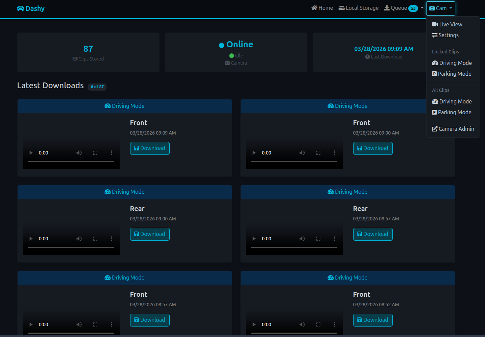

# Dashy

Dashy is a set of tools to aid in the ingestion and consumption of Viofo Dashcam footage. For those of us who love the hardware but hate the app — when you pull into the driveway and enable WiFi, locked clips are automatically downloaded to a storage path of your choice (including NFS). Dashy generates thumbnails and presents everything in a web UI.

Dashy also proxies your dashcam connection, letting you browse all clips on the camera and queue additional downloads from the UI.



> **Note:** Built around personal use with Viofo hardware. PRs welcome, but expect rough edges.

---

## A note on AI

This project uses AI (Claude) as a development tool to help get work done faster. All AI-generated code is reviewed by a human before being committed to this repository. AI is used as a productivity aid — not a replacement for human judgement or code review.

---

## Supported Hardware

| Camera | Status |
|---|---|
| Viofo A229-Plus | Fully supported (default) |
| Viofo A129-Plus Duo | Fully supported |
| Other Viofo models | May work — filename parsing is model-specific |

---

## Install

### Docker (Recommended)

```bash
docker run -d \
  --name dashy \
  -p 80:80 \
  -p 8080:8080 \
  -v $(pwd)/videos:/dashy/videos \
  -e CAM_MODEL="A229-Plus" \
  registry.gitlab.com/muddy6910/dashy:main
```

#### Environment Variables

| Variable | Default | Description |
|---|---|---|
| `CAM_MODEL` | `A229-Plus` | Camera model: `A229-Plus` or `A129-Plus` |
| `CAM_IP` | `192.168.1.254` | Camera IP in hotspot/AP mode |
| `CAM_WIFI_IP` | _(unset)_ | Camera IP on your home WiFi (A229-Plus only — preferred over AP mode when set) |
| `CAM_PORT` | `80` | Camera HTTP port |
| `CAM_PROXY_PORT` | `8080` | Port Dashy uses to proxy the camera UI |
| `DASHY_PORT` | `5000` | Internal Flask port |
| `DASHY_PROXY_PORT` | `80` | External port served by Nginx |
| `DATA_DIR` | `/dashy/videos` | Root directory for videos and thumbnails |
| `VIDEOS_DIR` | `$DATA_DIR/locked` | Directory for downloaded locked clips |
| `THUMBNAILS_DIR` | `$DATA_DIR/thumbnails` | Directory for generated thumbnails |
| `DOWNLOAD_LOCKED` | `true` | Download driving mode locked clips |
| `DOWNLOAD_PARKING` | `true` | Download parking mode locked clips |
| `SCRAPE_INTERVAL` | `900` | How often (seconds) to check for new clips |
| `RECONNECT_INTERVAL` | `300` | How often (seconds) to retry camera connection |
| `REQUEST_TIMEOUT` | `900` | Download request timeout in seconds |
| `RETENTION_ENABLED` | `true` | Auto-delete old clips |
| `RETENTION_DAYS` | `180` | Delete clips older than this many days (6 months default) |
| `HA_WEBHOOK_URL` | _(unset)_ | Home Assistant webhook URL — fired after each download cycle |
| `SSL_ENABLED` | `false` | Enable SSL on the Nginx proxy |
| `SSL_CERT_PATH` | _(unset)_ | Path to SSL certificate (required if SSL enabled) |
| `SSL_KEY_PATH` | _(unset)_ | Path to SSL private key (required if SSL enabled) |

---

### Raspberry Pi (bare metal)

Tested on Debian Buster and Bookworm. Requires a wired LAN connection — the Pi's WiFi is used to connect to the dashcam.

1. **Install system packages**
   ```bash
   sudo apt install python3 python3-pip python3-venv nginx git -y
   ```

2. **Create the Dashy directory**
   ```bash
   sudo mkdir /opt/dashy
   sudo chown $USER:$USER /opt/dashy
   cd /opt/dashy
   ```

3. **Clone the repo**
   ```bash
   git clone https://github.com/muddyland/dashy.git .
   ```

4. **Install Python dependencies**
   ```bash
   pip3 install -r requirements.txt
   ```

5. **Configure Nginx**
   ```bash
   sudo cp dashy_nginx.conf /etc/nginx/sites-enabled/dashy.conf
   sudo rm /etc/nginx/sites-enabled/default
   sudo nano /etc/nginx/sites-enabled/dashy.conf
   ```
   Check that:
   - `server_name` matches your hostname or IP
   - The camera IP matches your camera (default `192.168.1.254`)
   - `alias` paths match your video and thumbnail directories if non-default

6. **Create your config**
   ```bash
   cp config_template.json config.json
   nano config.json
   ```
   Key fields:
   ```json
   {
       "cam_ip": "192.168.1.254",
       "cam_wifi_ip": "10.x.x.x",
       "cam_model": "A229-Plus",
       "video_path": "videos",
       "download_parking": true,
       "download_locked": true,
       "retention_enabled": true,
       "retention_days": 180
   }
   ```

7. **Enable the systemd service**
   ```bash
   sudo cp dashy.service /etc/systemd/system/dashy.service
   # Edit the service file if your user is not 'pi'
   sudo systemctl enable dashy
   sudo systemctl start dashy
   ```

8. **Access the UI**

   | Service | URL |
   |---|---|
   | Dashy web UI | `http://<your-dashy-ip>/` |
   | Camera proxy | `http://<your-dashy-ip>:8080/` |

---

## SSL

SSL termination is handled by Nginx. Set `SSL_ENABLED=true` and provide paths to your certificate and key via `SSL_CERT_PATH` and `SSL_KEY_PATH`. Dashy is not intended to be publicly exposed — a local DNS + internal Let's Encrypt cert is the recommended approach.

---

## Home Assistant Integration

Set `HA_WEBHOOK_URL` to a Home Assistant webhook URL and Dashy will POST to it after each completed download cycle. Useful for automations like turning on a light when new clips arrive.

---

## Links

- [GitLab](https://gitlab.com/muddy6910/dashy) (primary)
- [GitHub](https://github.com/muddyland/dashy) (mirror)
