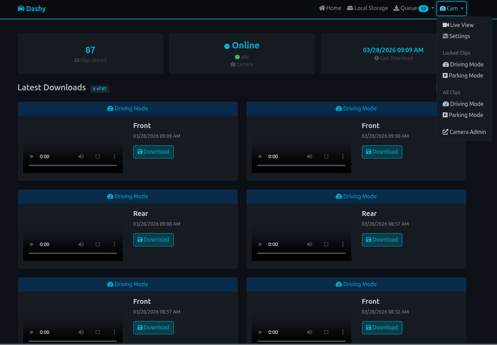

# Dashy

Dashy is a set of tools to aid in the ingestion and consumption of Viofo Dashcam footage. For those of us who love the hardware but hate the app — when you pull into the driveway and enable WiFi, locked clips are automatically downloaded to a storage path of your choice (including NFS). Dashy generates thumbnails and presents everything in a web UI.

Dashy also proxies your dashcam connection, letting you browse all clips on the camera and queue additional downloads from the UI.



> **Note:** Built around personal use with Viofo hardware. PRs welcome, but expect rough edges.

---

## A note on AI

This project uses AI (Claude) as a development tool to help get work done faster. All AI-generated code is reviewed by a human before being committed to this repository. AI is used as a productivity aid — not a replacement for human judgement or code review.

---

## Supported Hardware

| Camera | Status |
|---|---|
| Viofo A229-Plus | Fully supported (default) |
| Viofo A129-Plus Duo | Fully supported |
| Other Viofo models | May work — filename parsing is model-specific |

---

## Install

### Docker (Recommended)

```bash
docker run -d \
  --name dashy \
  -p 80:80 \
  -p 8080:8080 \
  -v $(pwd)/videos:/dashy/videos \
  -e CAM_MODEL="A229-Plus" \
  registry.gitlab.com/muddy6910/dashy:main
```

#### Environment Variables

| Variable | Default | Description |
|---|---|---|
| `CAM_MODEL` | `A229-Plus` | Camera model: `A229-Plus` or `A129-Plus` |
| `CAM_IP` | `192.168.1.254` | Camera IP in hotspot/AP mode |
| `CAM_WIFI_IP` | _(unset)_ | Camera IP on your home WiFi (A229-Plus only — preferred over AP mode when set) |
| `CAM_PORT` | `80` | Camera HTTP port |
| `CAM_PROXY_PORT` | `8080` | Port Dashy uses to proxy the camera UI |
| `DASHY_PORT` | `5000` | Internal Flask port |
| `DASHY_PROXY_PORT` | `80` | External port served by Nginx |
| `DATA_DIR` | `/dashy/videos` | Root directory for videos and thumbnails |
| `VIDEOS_DIR` | `$DATA_DIR/locked` | Directory for downloaded locked clips |
| `THUMBNAILS_DIR` | `$DATA_DIR/thumbnails` | Directory for generated thumbnails |
| `DOWNLOAD_LOCKED` | `true` | Download driving mode locked clips |
| `DOWNLOAD_PARKING` | `true` | Download parking mode locked clips |
| `SCRAPE_INTERVAL` | `900` | How long to idle between listing checks **once the queue is empty**. Clips still queued are downloaded back-to-back without waiting this out |
| `RECONNECT_INTERVAL` | `15` | How long to wait before retrying after a camera error |
| `DOWNLOAD_READ_TIMEOUT` | `45` | Seconds to wait for the next block of data before treating the link as dead. Not a deadline for the whole file |
| `DOWNLOAD_CHUNK_SIZE` | `262144` | Bytes per read. Above ~64 KiB throughput is flat; the size mainly bounds how much is re-fetched after a dropped connection |
| `DOWNLOAD_ATTEMPTS` | `3` | Attempts per clip before moving on. Interrupted clips resume, they don't restart |
| `PLAYBACK_MODE_FOR_DOWNLOADS` | `true` | Put the camera in playback mode while downloading — much faster, but it stops recording for the duration. See [Playback mode](#playback-mode-while-downloading) |
| `DELETE_AFTER_DOWNLOAD` | `true` | Delete each clip from the camera once it has downloaded successfully. See [Deleting clips](#deleting-clips-from-the-camera) |
| `DASHY_THREADS` | `8` | Worker threads. Must stay above 1 or an open live view blocks the whole UI |
| `DASHY_USERNAME` | _(unset)_ | Enable HTTP basic auth (with `DASHY_PASSWORD`). See [Security](#security) |
| `DASHY_PASSWORD` | _(unset)_ | Password for basic auth. Auth is off unless both are set |
| `RETENTION_ENABLED` | `true` | Auto-delete old clips |
| `RETENTION_DAYS` | `180` | Delete clips older than this many days (6 months default) |
| `HA_WEBHOOK_URL` | _(unset)_ | Home Assistant webhook URL — fired after each download cycle |
| `SSL_ENABLED` | `false` | Enable SSL on the Nginx proxy |
| `SSL_CERT_PATH` | _(unset)_ | Path to SSL certificate (required if SSL enabled) |
| `SSL_KEY_PATH` | _(unset)_ | Path to SSL private key (required if SSL enabled) |

---

### Raspberry Pi (bare metal)

Tested on Debian Buster and Bookworm. Requires a wired LAN connection — the Pi's WiFi is used to connect to the dashcam.

1. **Install system packages**
   ```bash
   sudo apt install python3 python3-pip python3-venv nginx git -y
   ```

2. **Create the Dashy directory**
   ```bash
   sudo mkdir /opt/dashy
   sudo chown $USER:$USER /opt/dashy
   cd /opt/dashy
   ```

3. **Clone the repo**
   ```bash
   git clone https://github.com/muddyland/dashy.git .
   ```

4. **Install Python dependencies**
   ```bash
   pip3 install -r requirements.txt
   ```

5. **Configure Nginx**
   ```bash
   sudo cp dashy_nginx.conf /etc/nginx/sites-enabled/dashy.conf
   sudo rm /etc/nginx/sites-enabled/default
   sudo nano /etc/nginx/sites-enabled/dashy.conf
   ```
   Check that:
   - `server_name` matches your hostname or IP
   - The camera IP matches your camera (default `192.168.1.254`)
   - `alias` paths match your video and thumbnail directories if non-default

6. **Create your config**
   ```bash
   cp config_template.json config.json
   nano config.json
   ```

   | Field | Default | Description |
   |---|---|---|
   | `cam_ip` | `192.168.1.254` | Camera IP in AP mode |
   | `cam_wifi_ip` | _(empty)_ | Camera IP on your home WiFi (A229-Plus). Tried **first** when set; leave empty if unused |
   | `cam_port` | `80` | Camera HTTP port |
   | `cam_model` | `A229-Plus` | `A229-Plus` or `A129-Plus` — decides filename parsing and command IDs |
   | `video_path` | `videos` | Root for clips and thumbnails |
   | `download_locked` / `download_parking` | `true` | Which locked clips to fetch |
   | `scrape_interval` | `900` | Idle seconds between listing checks **when the queue is empty** |
   | `reconnect_interval` | `15` | Seconds to wait before retrying after a camera error |
   | `download_read_timeout` | `45` | Seconds to wait for the next block before treating the link as dead |
   | `download_chunk_size` | `262144` | Bytes per read |
   | `download_attempts` | `3` | Attempts per clip before moving on |
   | `playback_mode_for_downloads` | `true` | Switch to playback mode while downloading — see [Playback mode](#playback-mode-while-downloading) |
   | `delete_after_download` | `true` | Delete clips from the camera once downloaded — see [Deleting clips](#deleting-clips-from-the-camera) |
   | `retention_enabled` / `retention_days` | `true` / `180` | Auto-delete old clips |
   | `auth_username` / `auth_password` | _(empty)_ | Enable HTTP basic auth — see [Security](#security) |

   Leave `cam_wifi_ip` empty rather than a placeholder if your camera doesn't join your home WiFi.

7. **Enable the systemd service**
   ```bash
   sudo cp dashy.service /etc/systemd/system/dashy.service
   # Edit the service file if your user is not 'pi'
   sudo systemctl enable dashy
   sudo systemctl start dashy
   ```

8. **Access the UI**

   | Service | URL |
   |---|---|
   | Dashy web UI | `http://<your-dashy-ip>/` |
   | Camera proxy | `http://<your-dashy-ip>:8080/` |

---

## Playback mode while downloading

Dashy switches the camera into playback mode (`cmd 3001 par=2`) before listing or downloading, then back to video mode when it's done. Otherwise the camera is encoding 4K, writing to the SD card, and serving the transfer over WiFi all at once — which is the main reason downloads crawl and connections drop mid-file.

**This stops recording for the duration of the download.** Dashy restores recording mode afterwards in all cases: on success, on error, and when the camera disappears mid-queue. It also restores it at startup, in case a previous run was killed mid-download. Even so, it is a real behaviour change worth knowing about.

To keep the camera recording throughout, at the cost of slower and less reliable downloads:

```bash
-e PLAYBACK_MODE_FOR_DOWNLOADS=false
```

`dashy_diag.py` measures the difference on your specific camera and tells you whether it's worth it.

---

## Deleting clips from the camera

Once a clip has downloaded successfully, Dashy deletes it from the camera so the card doesn't fill up. **This is on by default.** To keep clips on the camera:

```bash
-e DELETE_AFTER_DOWNLOAD=false
```

A clip is only ever deleted when its transfer completed *and* the size matched what the camera advertised — a partial, truncated or interrupted download never triggers a delete, and neither does a missing or empty local file. If the delete fails, it's logged and the clip is simply skipped next cycle.

> **This makes Dashy's copy the only copy.** Combined with `RETENTION_DAYS`, a clip is gone for good once retention deletes it locally. If the storage path isn't backed up, consider `DELETE_AFTER_DOWNLOAD=false` or `RETENTION_ENABLED=false`.

---

## Interrupting a download

Downloads can be stopped from the **Queue** dropdown in the navbar, or:

```bash
curl -X POST http://<dashy>/api/downloads/stop
```

Nothing is lost. The partly-downloaded clip is kept and stays queued, so when downloading resumes it picks up from where it stopped rather than starting the clip over. The camera is returned to recording mode immediately.

Downloading resumes after the normal `SCRAPE_INTERVAL` — it doesn't restart straight away, which would simply undo the interruption. That interval is also the window in which camera settings are unlocked, so stopping a download is the way to change settings without waiting for a long queue to finish.

---

## Settings are locked during downloads

Camera **writes** — settings changes, start/stop recording, take photo — are refused while a clip is downloading, and return `409` with a message the UI displays. The settings page and live view lock their controls and unlock again on their own once the transfer finishes.

Three reasons:

1. Changing the camera's WiFi name or password restarts its access point, which drops the link and kills the transfer mid-file.
2. Downloads hold the camera in playback mode, where recording-related settings are expected to be rejected — so the write would appear to fail for no visible reason.
3. The camera serves HTTP from a single thread while streaming the clip; every extra request competes with the transfer.

**Reads stay available**, so the settings page still shows current values. The live view's status polling is suspended during a transfer (it costs four camera commands per refresh) and shows `Downloading` instead.

Downloads are short, so in practice this is a brief lock rather than a real restriction.

---

## Security

Dashy assumes a trusted home LAN and ships with no authentication, which is fine on a segmented network and not fine otherwise. Anything that can reach the port can start and stop recording, delete clips, and read or change the dashcam's WiFi password.

To require credentials, set both:

```bash
-e DASHY_USERNAME=admin -e DASHY_PASSWORD='something-long'
```

HTTP basic auth then covers the whole UI and API. The Home Assistant endpoints (`/api/hass*`) and `/manifest.json` stay open so existing automations keep working. Basic auth sends credentials reversibly encoded, so pair it with `SSL_ENABLED=true` if the traffic crosses anything you don't control.

Two things auth does **not** cover:

- **The camera proxy on port 8080.** Nginx proxies the dashcam's own web UI there with no credentials in front of it. Don't publish that port beyond your LAN.
- **The clip and thumbnail directories**, served directly by Nginx with `autoindex on`.

Dashy is not intended to be exposed to the internet.

---

## Troubleshooting

### Protocol notes

How Dashy talks to the camera:

| | |
|---|---|
| Base URL | `http://192.168.1.254/?custom=1&cmd=<N>` |
| Response format | **XML** (`<Function><Cmd>…</Cmd><Status>…</Status></Function>`). Some models answer JSON; Dashy handles both |
| Set a number | `&par=<n>` |
| Set text | `&str=<text>` (WiFi name/password, stamps) |
| `<Status>` | Result code on a write, **current value** on a read |
| All settings | `cmd=3014` returns the whole table in one request |
| File list | `cmd=3015` returns name, path, size and timestamp for the whole card |
| Playback / video mode | `cmd=3001` with `par=2` / `par=1` |
| Heartbeat | `cmd=3016` |
| MJPEG stream | port `8192` |
| Notification socket | port `3333` (not used by Dashy) |

Clip metadata comes from the camera's file list when supported, so timestamps and sizes are read rather than inferred from filenames — which is what makes unlisted models work. Where filenames are used, the character before the extension gives the lens (`F` front, `R` rear, `I` interior, `T` tele), and parking vs driving comes from the directory rather than the filename.

### Camera commands do nothing

Use the diagnostic tool — it talks to your camera and reports what it actually does, rather than what the code assumes:

```bash
python3 dashy_diag.py
```

It reports the wire format the firmware answers in (JSON or XML), which query parameter it accepts for writes (`par` vs `param_0`), whether it supports resuming interrupted downloads, how much keep-alive helps, and how many simultaneous connections it tolerates before failing.

For a single command, `/api/cam/raw?cmd=3014` returns the camera's unparsed reply, and adding `&value=...` performs a write. Rejected commands surface the camera's own `rval` in the UI rather than failing silently.

### The queue keeps growing / clips never download

Loop recording overwrites clips continuously, so anything queued but not fetched before it was overwritten can never download. Dashy removes these automatically — it reconciles the queue against the camera's file list each cycle, and drops any clip that returns 404 when attempted.

To clear a backlog immediately, use the **Queue** dropdown in the navbar:

- **Remove clips no longer on camera** — drops only entries the camera doesn't have
- **Clear queue** — empties it entirely (downloaded clips and their history are kept, so anything still on the camera can be queued again)

Or via the API:

```bash
curl -X POST http://<dashy>/api/queue/prune   # remove stale entries
curl -X POST http://<dashy>/api/queue/clear   # empty the queue
```

Queuing everything from **Cam → All Clips** is the usual way a queue gets ahead of itself: unlocked clips rotate out fastest, so a large batch may be partly gone before it's fetched.

### Downloads are slow

Check the band first: `dashy_diag.py` prints the WiFi association. A 2.4 GHz link caps you at a few MB/s no matter how the client is tuned, and no client-side setting beats moving the camera to 5 GHz.

---

## SSL

SSL termination is handled by Nginx. Set `SSL_ENABLED=true` and provide paths to your certificate and key via `SSL_CERT_PATH` and `SSL_KEY_PATH`. Dashy is not intended to be publicly exposed — a local DNS + internal Let's Encrypt cert is the recommended approach.

---

## Home Assistant Integration

Set `HA_WEBHOOK_URL` to a Home Assistant webhook URL and Dashy will POST to it after each completed download cycle. Useful for automations like turning on a light when new clips arrive.

---

## Links

- [GitLab](https://gitlab.com/muddy6910/dashy) (primary)
- [GitHub](https://github.com/muddyland/dashy) (mirror)
